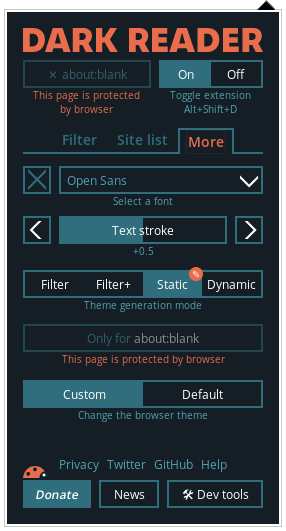

# Dark Green

    * Custom css

    ```
    * {
        background: #040 !important;
        color: #0F0 !important;
    }
    ```

    

    

# References

  [1]. [JWZ Source](view-source:https://www.jwz.org/blog/wp-content/themes/jwz/style.css?ver=10)
